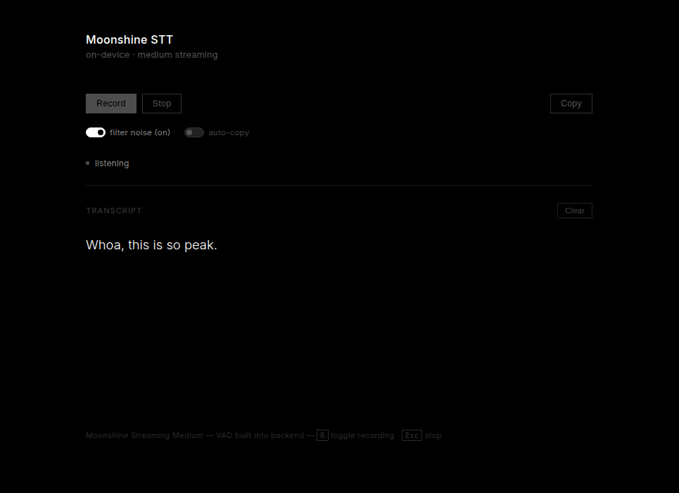

# Moonshine STT Demo

Real-time on-device speech-to-text in the browser using the [Moonshine](https://github.com/usefulsensors/moonshine) streaming model. No cloud, no API key — runs entirely on your machine.



## Features

- Real-time transcription via AudioWorklet → WebSocket → Moonshine SDK
- Noise / hallucination filter (drops filler words, silence artifacts)
- Rule-based post-processing (auto-capitalize, append period)
- Auto-copy to clipboard after each finalized line
- Keyboard shortcuts: `R` toggle recording, `Esc` stop

## Requirements

- Python 3.10+
- CUDA GPU recommended
- Microphone access in browser

## Setup

```bash
pip install -r requirements.txt
```

## Run

```bash
python main.py
```

Open [http://localhost:8000](http://localhost:8000) in your browser.

## How it works

1. Browser captures mic audio via `AudioWorklet`, downsamples to 16kHz float32 PCM
2. Raw PCM chunks sent over WebSocket as binary frames
3. FastAPI backend feeds audio to `moonshine-voice` SDK (`Transcriber`)
4. Partial and finalized transcripts streamed back and rendered in real time
