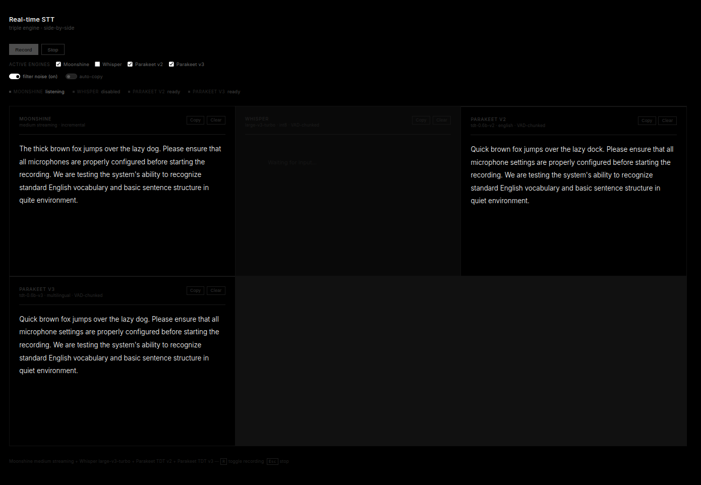

# Real-time STT Demo

Four-engine real-time speech-to-text in the browser — **Moonshine**, **Whisper**, **Parakeet v2**, and **Parakeet v3** receiving the same live mic audio simultaneously.



## Engines

| Engine | Model | Mode |
|--------|-------|------|
| [Moonshine](https://github.com/usefulsensors/moonshine) | medium-streaming | incremental — partials update word-by-word |
| [faster-whisper](https://github.com/SYSTRAN/faster-whisper) | large-v3-turbo · int8 | VAD-chunked — rolling interim every 1.5s |
| [Parakeet v2](https://huggingface.co/nvidia/parakeet-tdt-0.6b-v2) | tdt-0.6b-v2 | VAD-chunked — English-optimized |
| [Parakeet v3](https://huggingface.co/nvidia/parakeet-tdt-0.6b-v3) | tdt-0.6b-v3 | VAD-chunked — multilingual |

All engines receive the **same PCM audio** simultaneously via WebSocket fan-out from a single AudioWorklet.

## Features

- 2x2 panel layout — Moonshine, Whisper, Parakeet v2, Parakeet v3
- Per-engine enable checkboxes so you can disable heavy models (VRAM control)
- Real-time transcription via AudioWorklet → WebSocket → engine
- Whisper lazy-loads on first connection
- Parakeet v2/v3 lazy-load on first connection (via NeMo)
- Shared **filter noise** toggle — drops hallucination artifacts and filler words
- Shared **auto-copy** toggle — copies finalized text to clipboard automatically
- Per-panel **Copy** and **Clear** buttons
- **"new line" voice command** — saying "new line" inserts a paragraph break (command text not shown)
- Keyboard shortcuts: `R` toggle recording · `Esc` stop
- Dark theme, minimal UI

## Requirements

- Python 3.10+ (tested with Python 3.13)
- CUDA GPU recommended (Whisper/Parakeet on CPU can be slow)
- Microphone access in browser

Check your Python version before install:

```bash
python --version
```

Expected output: `Python 3.10` or newer.

## Setup

```bash
pip install -r requirements.txt
```

The project is tested against `moonshine_voice>=0.0.49`, where `Transcriber`
requires an explicit `model_path`. The app resolves and downloads the proper
Moonshine model path automatically at runtime.

On first run, Whisper large-v3-turbo and Parakeet models will auto-download into your local cache. Moonshine medium-streaming model is also downloaded automatically by the `moonshine-voice` package.

## Run

```bash
python main.py
```

If you see `ctranslate2 was not compiled with CUDA support`, run on CPU by setting:

```bash
WHISPER_DEVICE=cpu python main.py
```

Open [http://localhost:8000](http://localhost:8000) in your browser.

Optional device controls:

```bash
PARAKEET_DEVICE=cpu python main.py
PARAKEET_DEVICE=cuda python main.py
WHISPER_DEVICE=cpu python main.py
WHISPER_DEVICE=cuda python main.py
```

Recommended on 8 GB VRAM:

- Enable Moonshine + one heavy model at a time (Whisper **or** Parakeet v2 **or** Parakeet v3)
- Keep other heavy engines unchecked in the UI

## Project structure

```
├── main.py                  # FastAPI app — mounts all engines, serves frontend
├── engines/
│   ├── base.py              # STTEngine ABC + REGISTRY + @register decorator
│   ├── filters.py           # Noise filter + post-processing rules
│   ├── moonshine_engine.py  # Moonshine WS endpoint (/ws/moonshine)
│   ├── whisper_engine.py      # Whisper WS endpoint (/ws/whisper) + Silero VAD
│   ├── parakeet_common.py     # Shared Parakeet model/VAD helpers
│   ├── parakeet_v2_engine.py  # Parakeet v2 WS endpoint (/ws/parakeet-v2)
│   └── parakeet_v3_engine.py  # Parakeet v3 WS endpoint (/ws/parakeet-v3)
├── static/
│   └── index.html             # Full frontend — AudioWorklet, 2x2 multi-engine UI
└── requirements.txt
```

## How it works

1. Browser captures mic audio via `AudioWorklet`, downsamples to 16 kHz float32 PCM
2. Each PCM chunk is sent **simultaneously** to all WS engines as binary frames
3. **Moonshine**: feeds audio to `moonshine-voice` SDK (`Transcriber`); partials stream back incrementally word-by-word
4. **Whisper**: buffers audio, uses Silero VAD to detect speech boundaries, runs `faster-whisper` on completed chunks; rolling interim partials every 1.5s during active speech
5. **Parakeet v2/v3**: buffer audio with Silero VAD, then transcribe chunks using NeMo Parakeet models
6. Finalized transcripts rendered in real time in each panel

## Previous version

The original single-engine Moonshine-only demo lived in this folder before this rewrite. The refactor introduced the multi-engine architecture, Whisper support, and the dual-panel UI.
